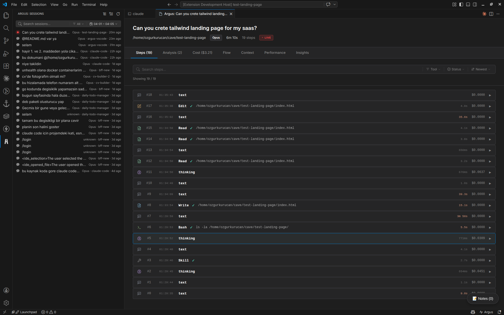
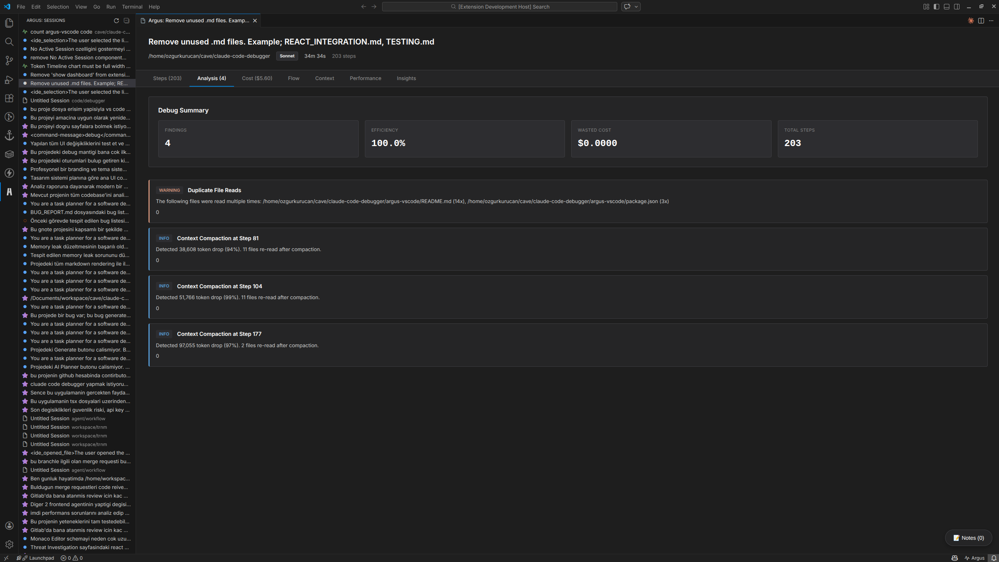
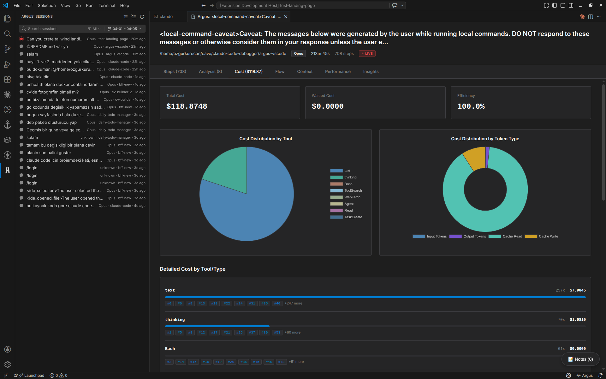
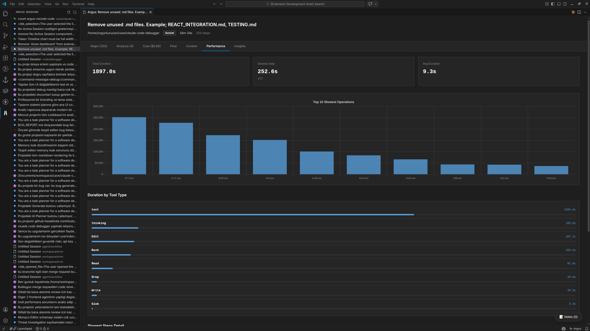
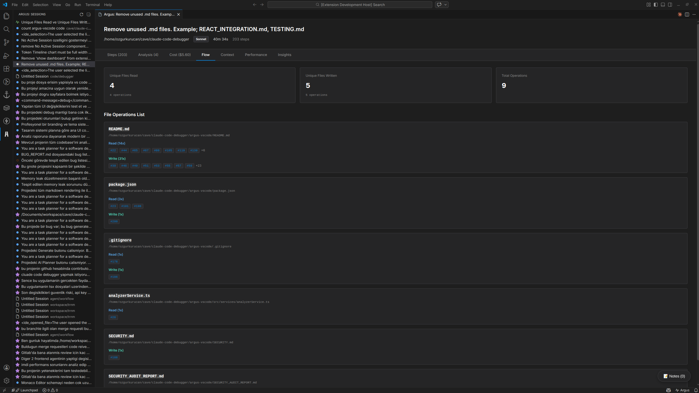
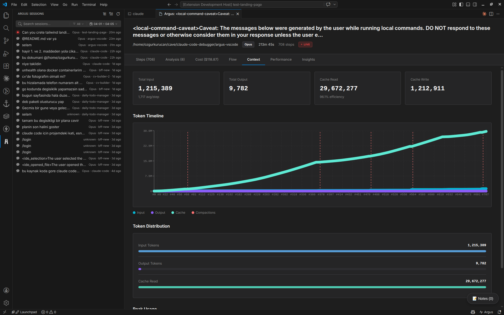
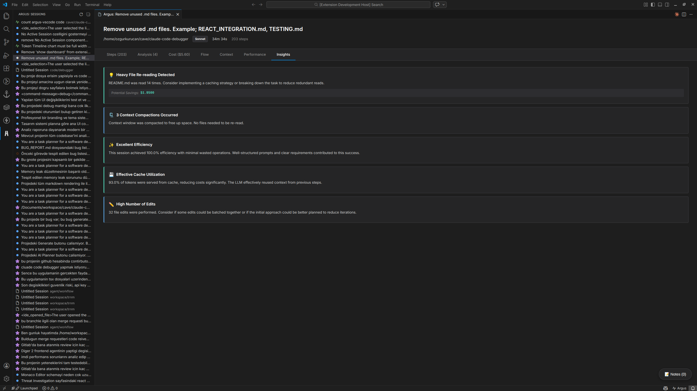

<p align="center">
  
</p>

<p align="center"><strong>Argus — Claude Code Agent Monitoring &amp; Observability on VSCode.</strong></p>

<p align="center">
  
  
  
  
  
  
</p>

<p align="center">
  <a href="https://github.com/yessGlory17/argus/issues"></a>
  <a href="https://github.com/yessGlory17/argus/issues"></a>
</p>

<p align="center"><strong>⭐ If Argus helps you ship better Claude Code sessions, a GitHub Star goes a long way.</strong></p>

<p align="center">
  <a href="#quick-start">Quick Start</a> ·
  <a href="#features">Features</a> ·
  <a href="#screenshots">Screenshots</a> ·
  <a href="#architecture">Architecture</a> ·
  <a href="#configuration">Configuration</a> ·
  <a href="#contributing">Contributing</a>
</p>

# Argus

**Argus** is an open-source VS Code extension that brings deep monitoring and observability to your Claude Code agent sessions. It reads the JSONL transcripts that Claude Code writes to `~/.claude/projects/`, parses every tool call, prompt, and token, and turns them into a coherent, inspectable picture of what your agent actually did — step by step, file by file, dollar by dollar.

Instead of treating each agent run as an opaque black box, Argus makes the full execution trace first-class: every Read, Write, Edit, Bash, WebFetch, and subagent call is timestamped, costed, and linked into the dependency graph it produced. You see retry loops before they burn through tokens, duplicated reads before they pad the context window, failed tools before they cascade, and compaction events before they erase state. Sessions stream live as Claude Code runs, so monitoring is continuous rather than post-mortem, and everything stays inside the editor where the work is already happening.

Named after the hundred-eyed watchman of Greek mythology, Argus is built for developers, teams, and researchers who want to understand — not guess — how their Claude Code agents spend time, money, and context.

## Video
<div align="center">
  <a href="https://www.youtube.com/watch?v=HmHOI1PBn_M">
    
  </a>
</div>

## Screenshots

<p align="center"><strong>Steps</strong> — searchable, filterable execution log</p>
<p align="center"></p>

<p align="center"><strong>Analysis</strong> — duplicate reads, retry loops, and optimization findings</p>
<p align="center"></p>

<p align="center"><strong>Cost</strong> — per-step token and USD breakdown with cache attribution</p>
<p align="center"></p>

<p align="center"><strong>Performance</strong> — efficiency scoring and wasted-cost analysis</p>
<p align="center"></p>

<p align="center"><strong>Flow</strong> — interactive dependency graph of file operations</p>
<p align="center"></p>

<p align="center"><strong>Context</strong> — token usage, cache-hit ratio, window utilization</p>
<p align="center"></p>

<p align="center"><strong>Insights</strong> — recommendations and pattern recognition</p>
<p align="center"></p>

## Table of Contents

- [Features](#features)
- [Quick Start](#quick-start)
- [Usage](#usage)
- [Configuration](#configuration)
- [Architecture](#architecture)
- [Use Cases](#use-cases)
- [Contributing](#contributing)
- [License](#license)

## Features

### Monitoring & observability

| Capability | What it gives you |
| --- | --- |
| **Live session watcher** | File-watcher tails the active JSONL transcript and re-renders the dashboard as Claude Code writes new events |
| **Automatic discovery** | Recursively scans `~/.claude/projects/` and surfaces every session — no manual import |
| **Subagent tracking** | Detects spawned subagents, attributes their tool calls, and links them back to the parent step |
| **Cost telemetry** | Per-step and per-session token + USD cost, broken down by input / output / cache read / cache write |
| **Context-window metrics** | Cache-hit ratio, window utilization, and compaction-event detection |

### Built-in analysis rules

Argus ships with a rule-based analyzer that flags the patterns that quietly waste tokens and time:

- **Duplicate reads** — the same file pulled into context multiple times
- **Unused operations** — tool outputs the agent never referenced again
- **Retry loops** — repeated failing tool calls with identical arguments
- **Failed tools** — non-zero exits, parse errors, permission denials
- **Context pressure** — windows approaching their cap before compaction
- **Compaction events** — detects when Claude Code dropped earlier history

### Multi-tab analysis dashboard

| Tab | What's inside |
| --- | --- |
| **Steps** | Full execution log with text search, multi-tool filter, status filter, sort by time/cost, per-step duration, per-tool icons |
| **Analysis** | All findings from the rule engine with severity, evidence, and jump-to-step links |
| **Cost** | Token & USD breakdown, model attribution, cache-hit ratio, spending charts |
| **Performance** | Efficiency score, wasted-cost estimate, bottleneck timing |
| **Flow** | D3-powered dependency graph of file Reads / Writes / Edits across steps |
| **Context** | Token budget, cache performance, I/O distribution, compaction markers |
| **Insights** | AI-derived recommendations and pattern observations |
| **Map** | Birds-eye view of the session topology |

### Sidebar & filtering

- Inline session search and model filter (Opus / Sonnet / Haiku)
- Date presets (1h / 24h / 7d / 30d) plus a custom calendar range picker
- Group by project, by model, or flat list
- Sticky headers, tabs, and filters that stay put while content scrolls
- Native dark-mode integration with the active VS Code theme

## Quick Start

### Requirements

- VS Code `1.80` or later
- Node.js `18+` (only for building from source)
- An existing Claude Code installation that writes sessions to `~/.claude/projects/`

### Install from VSIX (recommended)

Grab the latest `.vsix` from the [Releases page](https://github.com/yessGlory17/argus/releases) and install it:

```bash
code --install-extension argus-claude-0.2.0.vsix
```

Open VS Code, click the **Argus** eye icon in the Activity Bar, and your existing Claude Code sessions appear automatically. No login, no upload, no config — transcripts never leave your machine.

### Build from source

```bash
git clone https://github.com/yessGlory17/argus.git
cd argus/argus-vscode
npm install
npm run compile
npm run build:webview
npx vsce package
code --install-extension argus-claude-0.2.0.vsix
```

## Usage

1. Open VS Code with the Argus extension installed.
2. Click the **Argus** eye icon in the Activity Bar.
3. Your sessions are listed in the sidebar — search, filter, and group as needed.
4. Click any session to open the analysis dashboard in a new tab.
5. While Claude Code is running, leave the dashboard open: the live watcher updates it in real time.

### Commands

Available via Command Palette (`Ctrl/Cmd + Shift + P`):

| Command | Description |
| --- | --- |
| `Argus: Refresh Sessions` | Re-scan `~/.claude/projects/` with a progress indicator |
| `Argus: Open Session Detail` | Open the dashboard for a specific session |
| `Argus: Clear All Filters` | Reset every active sidebar filter |
| `Argus: Group by Project` | Group sessions by their project directory |
| `Argus: Group by Model` | Group sessions by Claude model |
| `Argus: Flat List` | Disable grouping |

## Configuration

Argus exposes the following VS Code settings:

```json
{
  "argus.scanDepth": 5,
  "argus.language": "en"
}
```

| Setting | Default | Description |
| --- | --- | --- |
| `argus.scanDepth` | `5` | Maximum directory depth when scanning `.claude` directories |
| `argus.language` | `"en"` | UI / findings language — `"en"` or `"tr"` |

## Architecture

### Stack

- **Extension host** — TypeScript on the VS Code Extension API, streaming JSONL parser, async file-system scan, file watchers
- **Webview** — React 19 + Vite 7, Chart.js + Recharts for cost/perf charts, D3.js for the dependency graph, Lucide for tool-type icons
- **Analyzer** — Pluggable rule engine; each rule consumes the parsed step list and returns typed findings

### Project layout

```
argus-vscode/
├── src/                              # Extension host
│   ├── extension.ts                  # Entry point, command registration
│   ├── types/                        # Models, parser, filter state
│   ├── services/
│   │   ├── discoveryService.ts       # Session discovery + file system scan
│   │   ├── parserService.ts          # JSONL streaming parser, cost calc
│   │   └── analyzerService.ts        # Rule engine
│   └── providers/
│       ├── sessionListViewProvider.ts        # Sidebar webview
│       ├── sessionWebviewProviderReact.ts    # Detail webview + live watcher
│       └── datePickerPanel.ts                # Custom date range picker
│
├── webview/                          # React UI
│   └── src/
│       ├── App.tsx                   # Tab routing
│       └── components/               # Steps / Analysis / Cost / Flow / ...
│
├── resources/                        # Sidebar SVG icons
├── screenshots/                      # README assets
├── package.json                      # Extension manifest
├── tsconfig.json
└── vite.config.ts
```

### Analysis engine

```typescript
interface AnalysisRule {
  name: string;
  analyze(steps: Step[]): Finding[];
}
```

Built-in rules: `DuplicateReadRule`, `UnusedReadRule`, `RetryLoopRule`, `FailedToolRule`, `ContextPressureRule`, `CompactionDetectedRule`. Adding a new rule is a single file plus one entry in the analyzer registry.

## Use Cases

| For developers | For teams | For researchers |
| --- | --- | --- |
| See how Claude Code actually approaches your tasks | Audit AI usage and cost across projects | Study LLM-driven development patterns at the trace level |
| Tighten prompts based on real token spend | Identify and codify best practices | Analyze tool-call distributions and retry behavior |
| Catch retry loops and duplicate reads early | Build internal training material from real sessions | Investigate context-window and compaction strategies |
| Track per-session AI-assisted development cost | Set budgets and monitor against them | Compare model behavior on identical workloads |

## Contributing

Contributions are welcome.

1. Fork the repository
2. Create a feature branch (`git checkout -b feature/your-feature`)
3. Make your changes — TypeScript on both extension host and webview
4. Run `npm run lint` and `npm run compile` before committing
5. Open a pull request describing the change and the motivation

For larger changes please open an issue first so we can align on direction.

## License

MIT — see [LICENSE](LICENSE).

---

<p align="center"><sub>Built by developers, for developers running Claude Code in anger.</sub></p>
<p align="center"><sub>⭐ Star the repo if Argus saves you tokens, time, or sanity.</sub></p>
